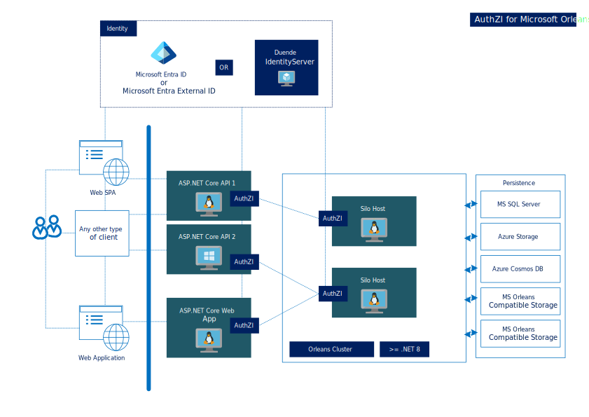
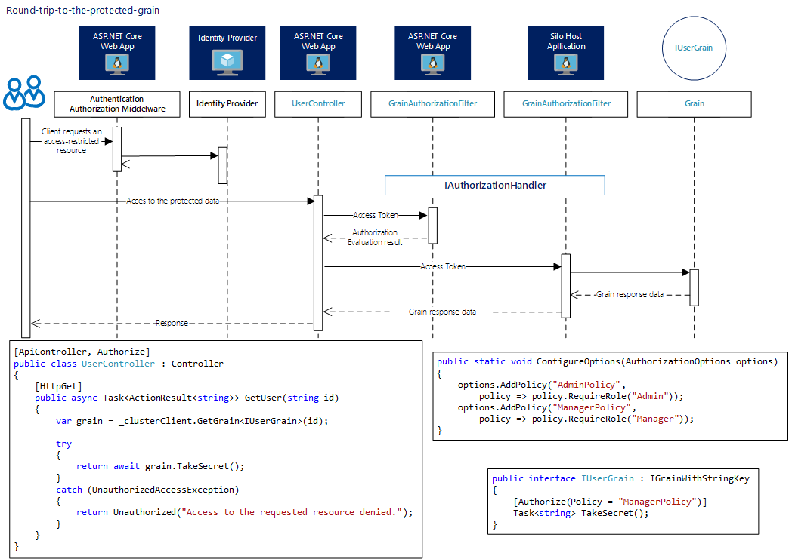

# Authorization functionality for Microsoft Orleans

The set of security packages for Microsoft Orleans 8.* provide the ability to use the same authorization functionality which is used in ASP.NET Core. It allows to use Microsoft Entra and Duende IdentityServer with MS Orleans grains and any ASP.NET Core 8.* application.

>[!NOTE]
>Authorization in Microsoft Orleans is mainly the same ASP.NET Core authorization. You can read more about 
>ASP.NET Core authorization **[here](https://learn.microsoft.com/en-us/aspnet/core/security/authorization/introduction?view=aspnetcore-8.0).**

The image below shows a round trip to the protected grain.

[Get started now](#getting-started) [View it on GitHub](https://github.com/Async-Hub/AuthZI)

---

## Getting started
### Dependencies
There are two packages: *Orleans.Security.Cluster* and *Orleans.Security.ClusterClient*. The first is for a silo host project and the seccond for an Orleans cluster client.

### Quick start

Please [see sample](https://github.com/Async-Hub/AuthZI-Samples) solutions for more details.