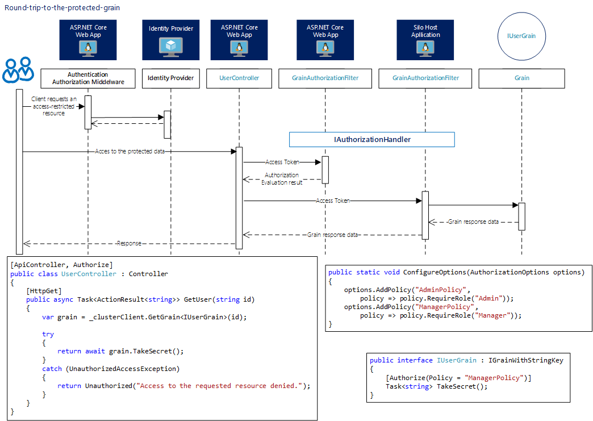

# Authorization functionality for Microsoft Orleans

[Get started now](#getting-started) [View it on GitHub](https://github.com/Async-Hub/AuthZI)

---

The security packages for Microsoft Orleans 8.\*/9.\*/10.\* enable authorization functionality similar to ASP.NET Core authorization. These packages support integration with Microsoft Entra and Duende IdentityServer for securing Orleans grains and ASP.NET Core applications.

>[!NOTE]
>Authorization behavior in Orleans follows the same core concepts as ASP.NET Core authorization. Read more in the [ASP.NET Core authorization documentation](https://learn.microsoft.com/en-us/aspnet/core/security/authorization/introduction).


The image below shows a round trip to the protected grain.



## Getting started
Below is a simple example of using Duende IdentityServer with Microsoft Orleans. For more details, visit the [sample repository path](https://github.com/Async-Hub/AuthZI/tree/master/samples/microsoft-orleans/IdentityServer).

### IdentityServer

```csharp
using AuthZI.MicrosoftOrleans.IdentityServer.SampleIdentityServer;

Console.Title = "IdentityServer";

var builder = WebApplication.CreateBuilder(args);

builder.Services.AddAuthorization();

builder.Services.AddIdentityServer()
  .AddDeveloperSigningCredential()
  .AddInMemoryApiScopes(IdentityServerConfig.GetApiScopes())
  .AddInMemoryApiResources(IdentityServerConfig.GetApiResources())
  .AddInMemoryIdentityResources(IdentityServerConfig.GetIdentityResources())
  .AddInMemoryClients(IdentityServerConfig.GetClients())
  .AddTestUsers(IdentityServerConfig.GetUsers());

var app = builder.Build();

app.UseRouting();

app.UseIdentityServer();
app.UseAuthorization();

app.MapGet("/", () => "IdentityServer is running...");

await app.RunAsync();
```

### Microsoft Orleans

```csharp
using AuthZI.MicrosoftOrleans.Authorization;
using AuthZI.Security.Authorization;

namespace AuthZI.MicrosoftOrleans.IdentityServer.SampleApiAndSiloHost;

public interface IProtectedGrain : IGrainWithStringKey
{
  [Authorize(Roles = "Admin")]
  Task<string> TakeSecret();
}

public class ProtectedGrain(SecureGrainContext secureGrainContext) : 
  SecureGrain(secureGrainContext), IProtectedGrain
{
  public Task<string> TakeSecret()
  {
    return Task.FromResult("Success! You see the data which is available only for Admin role.");
  }
}

using AuthZI.Identity.Duende.IdentityServer;
using AuthZI.MicrosoftOrleans.Authorization;
using AuthZI.MicrosoftOrleans.Duende.IdentityServer;
using AuthZI.MicrosoftOrleans.IdentityServer.SampleApiAndSiloHost;
using AuthZI.Security;

Console.Title = @"Api and SiloHost";

var builder = WebApplication.CreateBuilder(args);

var identityServerConfig = new IdentityServerConfig("https://localhost:7171",
  "Cluster", @"@3x3g*RLez$TNU!_7!QW", "Cluster");

builder.Services.AddHttpContextAccessor();
builder.Services.AddTransient<IAccessTokenProvider, AccessTokenProvider>();

builder.Host.UseOrleans((context, siloBuilder) =>
  {
    siloBuilder.UseLocalhostClustering()
      .ConfigureServices(services =>
      {
        services.AddOrleansAuthorization(identityServerConfig, config => { },
          new AuthorizationConfiguration(true));
      });
  })
  .UseConsoleLifetime()
  .ConfigureLogging(loggingBuilder =>
  {
    loggingBuilder.AddConsole();
  });

var app = builder.Build();

app.MapGet("/", () => "Running...");

app.MapGet("/protected-grain",
  static async (IGrainFactory grains, HttpRequest request) =>
  {
    var protectedGrain =
      grains.GetGrain<IProtectedGrain>(nameof(IProtectedGrain));

    try
    {
      var secret = await protectedGrain.TakeSecret();
      return Results.Ok(secret);
    }
    catch (AuthorizationException ex)
    {
      Console.WriteLine(ex.Message);
      return Results.Unauthorized();
    }
  });

await app.RunAsync();
```

### Sample Client
```csharp
using AuthZI.MicrosoftOrleans.IdentityServer.SampleWebClient;
using Duende.IdentityModel.Client;

Console.Title = "WebClient";

var builder = WebApplication.CreateBuilder(args);
var app = builder.Build();

Console.WriteLine("Please press 's' to start.");
Console.ReadLine();

var identityServerUrl = "https://localhost:7171";
var accessToken = await AccessTokenRetriever.RetrieveToken(identityServerUrl);
Console.WriteLine($"AccessToken: {accessToken}");

var apiUrl = "https://localhost:7116";
var httpClient = new HttpClient() { BaseAddress = new Uri(apiUrl) };
httpClient.SetBearerToken(accessToken);

var response = await httpClient.GetAsync($"/protected-grain");
if (!response.IsSuccessStatusCode)
{
  Console.WriteLine(response.StatusCode);
  Console.WriteLine(response.Content.ToString());
}
else
{
  var content = await response.Content.ReadAsStringAsync();
  Console.WriteLine(content);
}

app.MapGet("/", () => "WebClient is running...");

await app.RunAsync();
```

### Quick start

See [AuthZI sample solutions](https://github.com/Async-Hub/AuthZI-Samples) for more end-to-end scenarios.