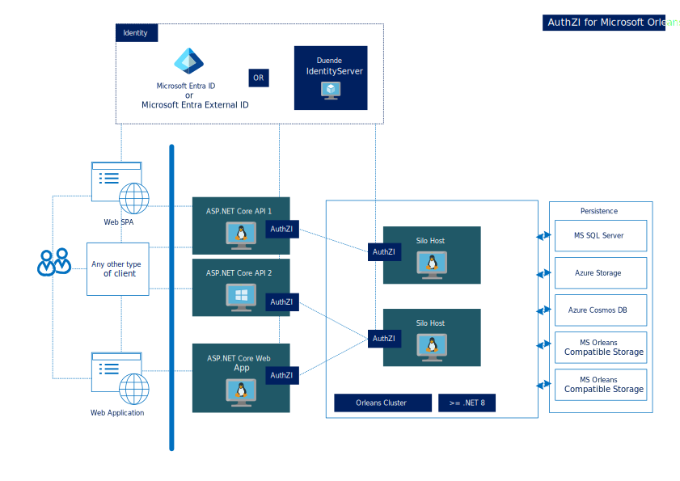

# **Auth**ori**z**ation **I**nteroperability - AuthZI for .NET

### Refer to [AuthZI](https://github.com/Async-Hub/AuthZI) for sources.
\
Do you like the authorization model used in **Microsoft ASP.NET**? **AuthZI** brings a similar
authorization approach to Microsoft Orleans and Azure Functions with Microsoft Entra and Duende IdentityServer.
\
\
AuthZI is an open-source set of libraries for authorization interoperability for .NET 8 and above, based on OAuth 2.0.

### Documentation

- [Microsoft Orleans](documents/microsoft-orleans/microsoft-orleans.md)

---

### License

AuthZI is distributed by an MIT license.

### Contributing

Contributions are welcome. Please contact the project owners via [Azure DevOps](https://dev.azure.com/async-hub/AuthZI/_workitems/recentlyupdated/), email <admin@asynchub.org>, or another preferred channel.